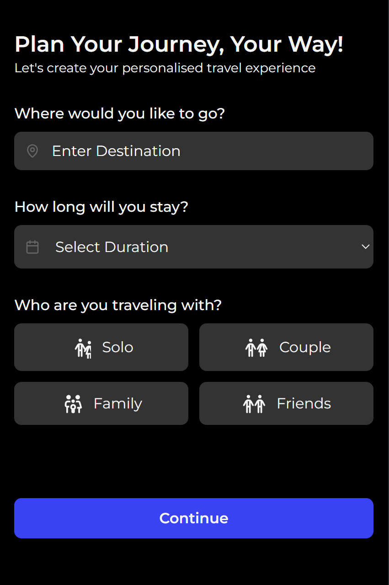

# Trippin - Travel Blog Project

## Project Structure

This Next.js 15 project follows the App Router pattern with a `src` directory structure:

- `/src/app` - Main application code using Next.js App Router
- `/src/components` - Shared components used across multiple pages
- `/public` - Static assets (images)

## Component Hierarchy

The application follows a nested component structure:

1. **Root Layout** (`src/app/layout.tsx`)
   - Provides theme context and global styling
   - Uses Montserrat font

2. **Page Components**
   - Home page (`src/app/home/page.tsx`)
   - Create page (`src/app/create/page.tsx`)
   - Other pages using `UnderConstruction` component

3. **Feature Components**
   - Navigation components (`Navbar`)
   - Content sections (`Header`, `Flight`, `Accommodation`, `Activities`)
   - Shared UI (`Footer`, `UnderConstruction`)

## Key Features

- **Dark/Light Theme** - Implemented via ThemeProvider context
- **Responsive Design** - Mobile-first approach with Tailwind CSS
- **Navigation** - Bottom navigation bar with active state indicators
- **Trip Information Display** - Sections for upcoming trips, flights, accommodations

## Technical Implementation

- **Next.js 15** - Latest features of Next.js framework
- **TypeScript** - Type-safe code throughout the application
- **Tailwind CSS** - Utility-first styling approach
- **Lucide Icons** - Modern icon library for UI elements

## Challenges and Solutions

- **Theme Implementation** - Used context API for consistent theming across components
- **Responsive Layouts** - Implemented horizontal scrolling for card components
- **Component Organization** - Structured components by feature and shared functionality
- **Type Safety** - Ensured proper TypeScript interfaces for component props
